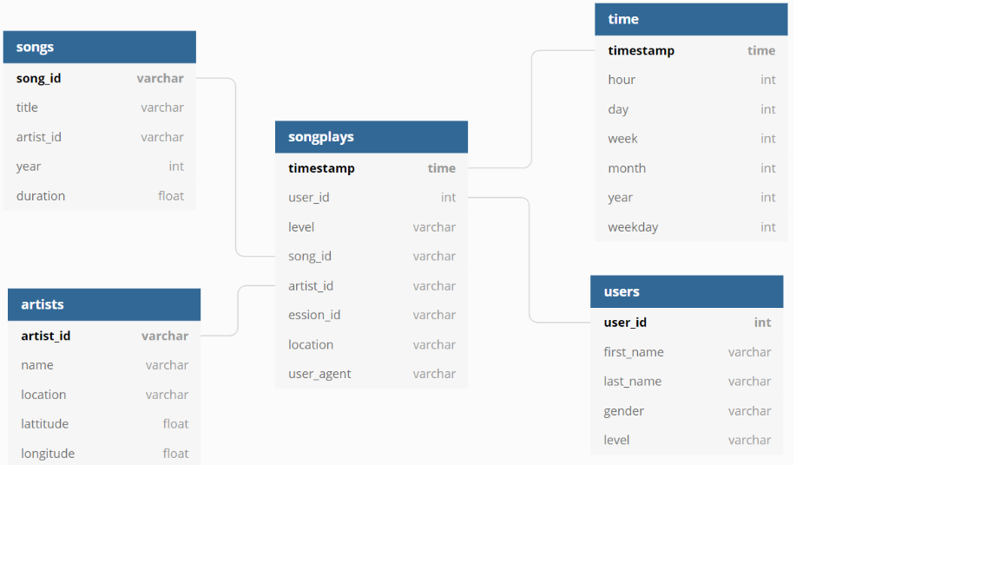

# Datalake in AWS.
### 1. Introduction.

A music streaming startup, Sparkify, has grown their user base and song database and want to move their processes and data onto the cloud. Their data resides in S3, in a directory of JSON logs on user activity on the app, as well as a directory with JSON metadata on the songs in their app.

The goal of this project is to create an ETL pipeline that extracts their data from S3, processed them with PySpark and send them back into another S3. In the processing phase, we transform data into a set of dimensional tables for their analytics team to continue finding insights in what songs their users are listening to.

### 2. Available Data.

##### 2.1. Song Dataset.

The first dataset resides on the AWS S3 bucket **s3://udacity-dend/song_data** directory and it's composed of JSON format files that contains metadata about a song and the artist of that song. The files are partitioned by the first three letters of each song's track ID. For example, here are filepaths to two files in this dataset.

And below is an example of what a single song file, TRAABJL12903CDCF1A.json, looks like.

`{"num_songs": 1, "artist_id": "ARJIE2Y1187B994AB7", "artist_latitude": null, "artist_longitude": null, "artist_location": "", "artist_name": "Line Renaud", "song_id": "SOUPIRU12A6D4FA1E1", "title": "Der Kleine Dompfaff", "duration": 152.92036, "year": 0}`

##### 2.2. Log Dataset.

The second dataset consists of log files in JSON format generated by this event simulator based on the songs in the dataset above. These simulate activity logs from a music streaming app based on specified configurations.

The data of this dataset resides on the AWS S3 bucket **s3://udacity-dend/log_data** and it's partitioned by year and month. For example, one filepath in this dataset would be `log_data/2018/11/2018-11-12-events.json`.

### 3. Model Structure.

The model defined with the previous data is a Star Model composed of the following tables:

| TABLE | TYPE | DESCRIPTION | FIELDS | PRIMARY KEY |
|----------|-----------|-------------------------------------------------------------------|------------------------------------------------------------------------------------------------|-------------|
| songplay | Fact | Records in log data associated with song plays | songplay_id, start_time, user_id, level, song_id, artist_id, session_id, location, user_agent  | songplay_id |
| user | Dimension | Users in the app | user_id, first_name, last_name, gender, level | user_id |
| song | Dimension | Songs in music database | song_id, title, artist_id, year, duration | song_id |
| artist | Dimension | Artists in music database | artist_id, name, location, latitude, longitude | artist_id |
| time | Dimension | Timestamps of records in songplays broken down into specific unit | start_time, hour, day, week, month, year, weekday | start_time |

Graphically, the design of the database is the following:

### 4. Project Structure.

On this section we explain the different sections of the project. The order in which they are discussed it's the execution order of the different scripts.

##### 4.1. (Optional) `list_bucket.py`.

On this part we create a function that, using the Python SDK client boto3, list all the folders on a specified AWS S3 bucket. We make use of this function to have an idea of the structure of the **s3://udacity-dend/song_data** and **s3://udacity-dend/log_data** buckets.

##### 4.2. `etl.py`.

This is the main module of the project. It creates a SparkSession downloading the dependencies than allows us using Hadoop and Spark on it. We set the AWS credentials, read the S3 buckets and perform all the processes to create de different tables in the model. At the end, we persist all the tables compressed in parquet on another AWS S3 bucket.

##### 4.3. `dl.cfg`

Configuration file containing data about authentication in AWS. ***By security reasons, AWS authentication keys are not pushed into GitHub***.

### 5. Execution order of python scripts.

First of all, an IAM user with S3FullAccess policy role must have been created on our AWS account. Downloading its authentications keys, we must fix the parameters in *dwh.cfg* set. After that, go to CLI and type:

`>> python list_buckets.py`

This command is optional. When this script is executed we list the folders in the bucket and check the structure of the input folders. With it, the script `etl.py` can be completed.

After that, return to CLI and code:

`>> python etl.py`

to execute the etl.py script that extract the data from buckets, transforms it properly and load it into the datalake again.
