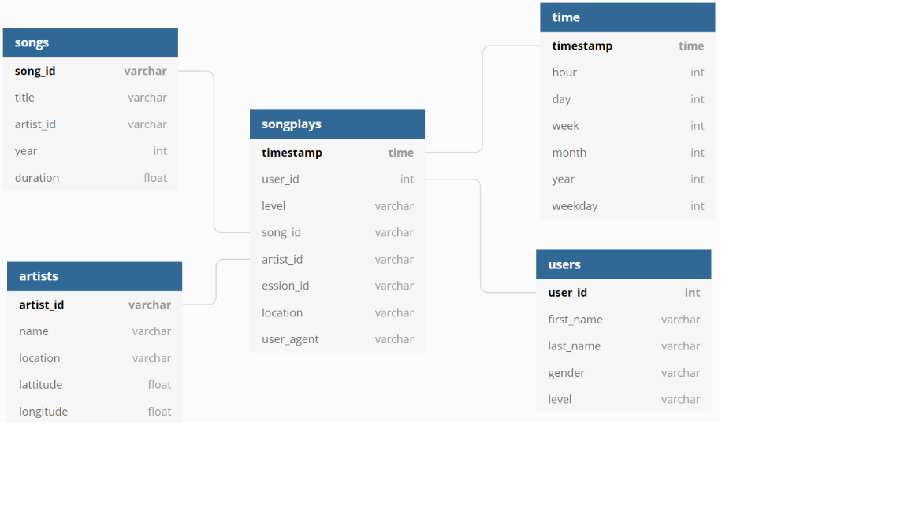
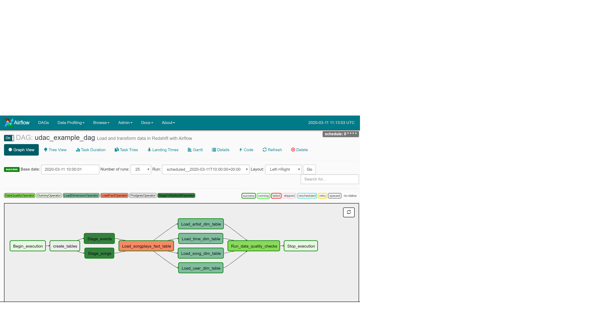
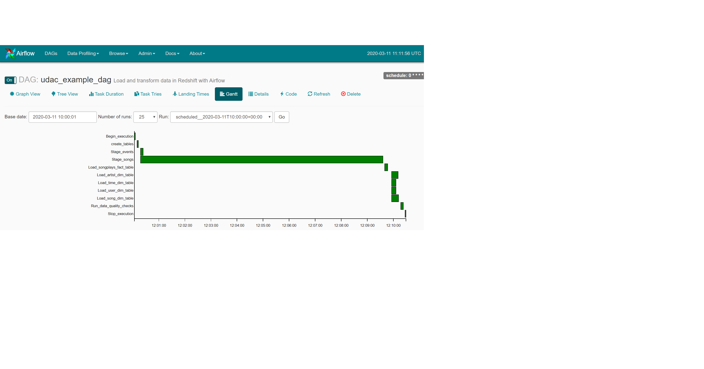

# Cloud Data Warehousing in AWS Redshift.
### 1. Introduction.

A music streaming company, Sparkify, has decided that it is time to introduce more automation and monitoring to their data warehouse ETL pipelines and come to the conclusion that the best tool to achieve this is Apache Airflow.

The goal of this project is to create high grade data pipelines that are dynamic and built from reusable tasks, can be monitored, and allow easy backfills. They have also noted that the data quality plays a big part when analyses are executed on top the data warehouse and want to run tests against their datasets after the ETL steps have been executed to catch any discrepancies in the datasets.

The source data resides in S3 and needs to be processed in Sparkify's data warehouse in Amazon Redshift. The source datasets consist of JSON logs that tell about user activity in the application and JSON metadata about the songs the users listen to.

### 2. Available Data.

##### 2.1. Song Dataset.

The first dataset resides on the AWS S3 bucket **s3://udacity-dend/song_data** directory and it's composed of JSON format files that contains metadata about a song and the artist of that song. The files are partitioned by the first three letters of each song's track ID. For example, here are filepaths to two files in this dataset.

And below is an example of what a single song file, TRAABJL12903CDCF1A.json, looks like.

`{"num_songs": 1, "artist_id": "ARJIE2Y1187B994AB7", "artist_latitude": null, "artist_longitude": null, "artist_location": "", "artist_name": "Line Renaud", "song_id": "SOUPIRU12A6D4FA1E1", "title": "Der Kleine Dompfaff", "duration": 152.92036, "year": 0}`

##### 2.2. Log Dataset.

The second dataset consists of log files in JSON format generated by this event simulator based on the songs in the dataset above. These simulate activity logs from a music streaming app based on specified configurations.

The data of this dataset resides on the AWS S3 bucket **s3://udacity-dend/log_data** and it's partitioned by year and month. For example, one filepath in this dataset would be `log_data/2018/11/2018-11-12-events.json`.

### 3. Model Structure.

The model defined with the previous data is a Star Model composed of the following tables:

| TABLE | TYPE | DESCRIPTION | FIELDS | PRIMARY KEY |
|----------|-----------|-------------------------------------------------------------------|------------------------------------------------------------------------------------------------|-------------|
| songplay | Fact | Records in log data associated with song plays | songplay_id, start_time, user_id, level, song_id, artist_id, session_id, location, user_agent  | songplay_id |
| user | Dimension | Users in the app | user_id, first_name, last_name, gender, level | user_id |
| song | Dimension | Songs in music database | song_id, title, artist_id, year, duration | song_id |
| artist | Dimension | Artists in music database | artist_id, name, location, latitude, longitude | artist_id |
| time | Dimension | Timestamps of records in songplays broken down into specific unit | start_time, hour, day, week, month, year, weekday | start_time |

Graphically, the design of the database is the following:

### 4. Project Structure.

On this section we explain the different sections of the project. The order in which they are discussed it's the execution order of the different scripts.

##### 4.1. `plugins/operators/stage_redshift.py`.

On this part we set the class `StageToRedshiftOperator`. It uses the AWS credentials and Redshift credentials to copy data from the specified S3 bucket into the AWS Redshift table specified.

##### 4.2. `plugins/operators/load_fact.py`.

On this part we set the class `LoadFactOperator`. It uses Redshift credentials to insert into an specified fact table the data got from an sql query.

##### 4.3. `plugins/operators/load_dimension.py`.

On this part we set the class `LoadDimensionOperator`. It uses Redshift credentials to insert into an specified dimension table the data got from an sql query.

##### 4.4. `plugins/operators/data_quality.py`. 

On this part we set the class `DataQualityOperator`. When is instanciated for many tables, it performs some quality checks for each of them.

##### 4.5. `dags/udac_example_dag.py`

Is the main part of the code. It is used to define the DAG structure, create tables metadata in redshift (throught a task) and instanciate the different previous classes that perform the different tasks. Furthermore, it order the tasks to be a directed acyclic graph. 

##### 4.6. `plugins/helpers/sql_queries.py`
Contain the sql_queries that are called in different parts of the code.

### 5. Results in Airflow.

When the DAG is executed, we can see in the Airflow UI several aspects. For example, the execution graph:

and the Gantt diagram of the tasks:

