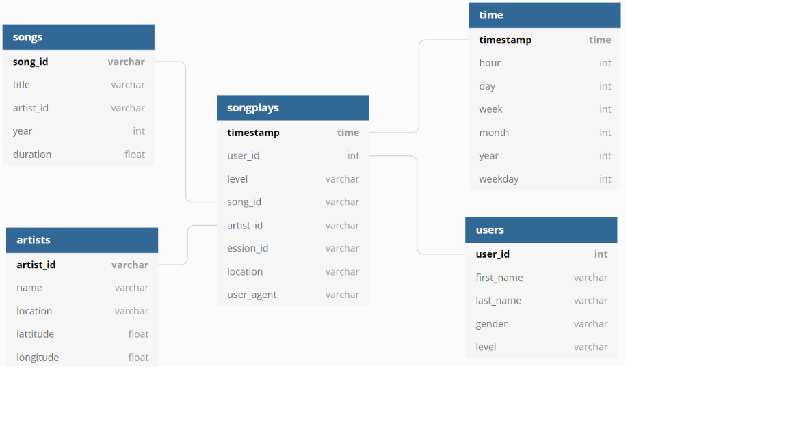

# Cloud Data Warehousing in AWS Redshift.
### 1. Introduction.

A music streaming startup, Sparkify, has grown their user base and song database and want to move their processes and data onto the cloud. Their data resides in S3, in a directory of JSON logs on user activity on the app, as well as a directory with JSON metadata on the songs in their app.

The goal of this project is to create an ETL pipeline that extracts their data from S3, stages them in Redshift, and transforms data into a set of dimensional tables for their analytics team to continue finding insights in what songs their users are listening to. The database and ETL pipeline will be tested by running queries given to you by the analytics team from Sparkify.

### 2. Available Data.

##### 2.1. Song Dataset.

The first dataset resides on the AWS S3 bucket **s3://udacity-dend/song_data** directory and it's composed of JSON format files that contains metadata about a song and the artist of that song. The files are partitioned by the first three letters of each song's track ID. For example, here are filepaths to two files in this dataset.

And below is an example of what a single song file, TRAABJL12903CDCF1A.json, looks like.

`{"num_songs": 1, "artist_id": "ARJIE2Y1187B994AB7", "artist_latitude": null, "artist_longitude": null, "artist_location": "", "artist_name": "Line Renaud", "song_id": "SOUPIRU12A6D4FA1E1", "title": "Der Kleine Dompfaff", "duration": 152.92036, "year": 0}`

##### 2.2. Log Dataset.

The second dataset consists of log files in JSON format generated by this event simulator based on the songs in the dataset above. These simulate activity logs from a music streaming app based on specified configurations.

The data of this dataset resides on the AWS S3 bucket **s3://udacity-dend/log_data** and it's partitioned by year and month. For example, one filepath in this dataset would be `log_data/2018/11/2018-11-12-events.json`.

### 3. Model Structure.

The model defined with the previous data is a Star Model composed of the following tables:

| TABLE | TYPE | DESCRIPTION | FIELDS | PRIMARY KEY |
|----------|-----------|-------------------------------------------------------------------|------------------------------------------------------------------------------------------------|-------------|
| songplay | Fact | Records in log data associated with song plays | songplay_id, start_time, user_id, level, song_id, artist_id, session_id, location, user_agent  | songplay_id |
| user | Dimension | Users in the app | user_id, first_name, last_name, gender, level | user_id |
| song | Dimension | Songs in music database | song_id, title, artist_id, year, duration | song_id |
| artist | Dimension | Artists in music database | artist_id, name, location, latitude, longitude | artist_id |
| time | Dimension | Timestamps of records in songplays broken down into specific unit | start_time, hour, day, week, month, year, weekday | start_time |

Graphically, the design of the database is the following:

### 4. Project Structure.

On this section we explain the different sections of the project. The order in which they are discussed it's the execution order of the different scripts.

##### 4.1. `create_resources.py`.

On this part we set all the AWS infraestructure as a code. We are using the Python SDK client boto3 to create roles, set permissions, create the redshift cluster and assign it policies. ***It's necessary to have this file completed before executing any other script.***

##### 4.2. `create_tables.py`.

This script create Sparkify database, connects to the Redshift cluster with appropiate authentication and drops and create the tables defined on the previous section.

##### 4.3. `etl.py`.

In this module we copy the data from the S3 buckets into stanging_tables and insert into different tables its corresponding data.

##### 4.4. `data_analysis.py`. 

In this script we run the analytics queries that check if the proccess has been done correctly.

##### 4.5. `delete_resources.py`

In this script, we delete the redshift cluster and the roles that were created in 4.1. ***It's important to run this script when finish the process to avoid unnecessary AWS costs.***

##### 4.6. `sql_queries.py`
This module contains all the queries that are applied throught the different scripts.

##### 4.7. `dwh.cfg`

Configuration file containing data about: Authentication in AWS, hardware properties of the Redshift Cluster, authentication to the database in redshift and paths of S3 were files are located. ***By security reasons, AWS authentication keys are not pushed into GitHub***.

### 5. Execution order of python scripts.

First of all, the queries in *sql_queries.py* must be completed and the parameters in *dwh.cfg* set. After that, go to CLI and type:

`>> python create_resources.py`

This command will execute this script and, once it's done, return to CLI and type:

`>> python create_tables.py`

When is finished, code:

`>> python etl.py`

to execute the etl.py script that extract the data, transforms it properly and load it into the Redshift database. After that:

`>> python data_analysis.py`

will show the result of the queries on the console to evaluate if the process have run properly.

To end with, we delete all the AWS resources deployed by running the following command on the console:

`>> python delete_resources.py`